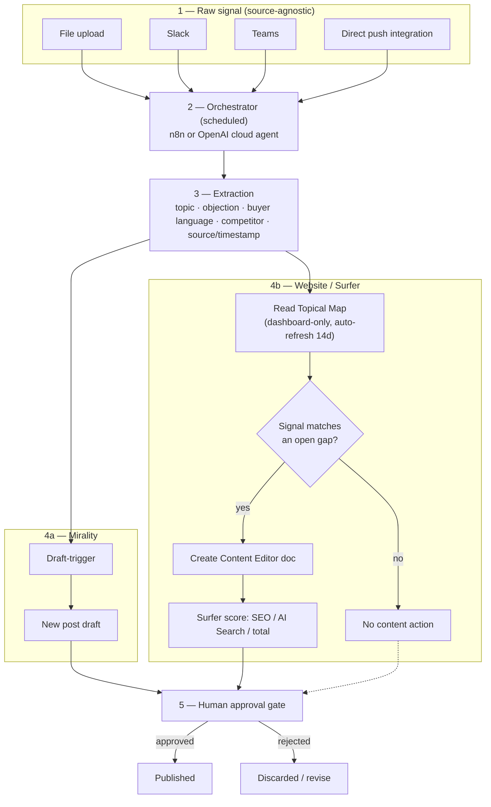

# GTM Content on Auto-Pilot — High-Level Data Flow

Not the hackathon's 90-min build spec — this is the standing architecture for the idea itself, buildable over the extended timeline. See PRD.md / SPONSORS.md for the narrower hackathon-scoped versions.

## Shape

```
[raw signal in] → [orchestrator, scheduled] → [extraction] → [two output tracks] → [human approval] → [published]
```



## 1. Trigger — orchestrator, not a one-off script

Runs on a schedule (cron-style, same pattern as `/schedule` in Claude Code) rather than being manually invoked per input. Candidate runtimes:
- **n8n** — visual workflow, easiest to wire multiple integrations without custom glue per source
- **OpenAI cloud agent** (Codex-hosted) — if the hackathon's Codex credits extend to a persistent/scheduled agent, not just a one-shot CLI run

Either way: the orchestrator's job is "wake up, check for new raw signal, hand it to extraction." Not committed to one runtime yet — n8n if source breadth matters more than reasoning quality, cloud agent if the extraction step itself needs to be smart.

## 2. Input — deliberately source-agnostic

No single input is locked in. Any of:
- File upload (transcript, notes, doc)
- Slack channel/DM (message or thread)
- Teams
- Direct push integration from another tool (e.g. a call-recording tool pushing transcripts automatically)

The extraction step doesn't care where the text came from — this keeps the pipeline reusable rather than hardcoded to one channel.

## 3. Extraction

Turns raw, unstructured input into structured GTM signal: topic, objection/question, buyer's own language, competitor mentioned (if any), source, timestamp. This is the one step every downstream track depends on — garbage in here means garbage in both output tracks.

## 4. Two output tracks

**Track A — Mirality (brand/LinkedIn content)**
Signal → feeds into the existing Mirality draft pipeline → new post draft, grounded in real conversation rather than a blank-page prompt.

**Track B — Website (Surfer)**
Signal → checked against Surfer's Topical Map coverage (map itself is dashboard-only, auto-refreshes every 14 days — Codex reads it, doesn't edit it) → if the signal matches a gap the map already flagged, Codex creates/updates a Content Editor doc for that page. Surfer's own scoring (SEO/AI Search/total) validates the draft, not just LLM judgment.

## 5. Human approval gate

Every draft — Mirality post or Surfer content — surfaces for approval before publish. The orchestrator never publishes unapproved. This holds the same constraint carried through every version of this idea: agent drafts, human decides.

## Open questions to resolve before building

- [ ] n8n vs. OpenAI cloud agent — pick based on how much reasoning the extraction step needs vs. how many integrations need wiring
- [ ] Confirm Mirality's pipeline can accept a programmatic draft trigger (not just manual compose) — check `apps/mirality` for an API/webhook entry point
- [ ] Confirm Surfer MCP's Content Editor creation call can be scoped to an existing topical-map gap, or whether that mapping has to happen manually (read the map, decide the target keyword yourself, then call Content Editor creation)
- [ ] Pick the first real input source to build against — everything else in the pipeline is source-agnostic, but the first version needs one concrete source to test end-to-end
