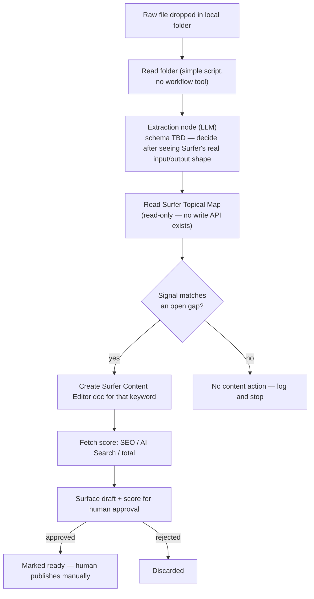

# Track 1 — Orchestration: Raw Data → Surfer Content

**Self-contained implementation doc.** You shouldn't need to read the other files in this repo to start building, though DATAFLOW.md has the fuller architecture picture if you want context. This is one of three parallel tracks (Track 2 = Mirality app model-agnostic backend, Track 3 = Mirality's public site as the publish target) — you can build this one independently, nothing here blocks on the other two.

## TL;DR

Build a pipeline: raw GTM signal (a sales call transcript, notes, anything text-based) gets dropped as a file into a local folder → it gets turned into structured data (topic, objection, buyer's own language) → that gets checked against Surfer SEO's Topical Map for a content gap it matches → if it matches, create a Surfer Content Editor doc for that keyword and pull back its score → surface the result for a human to approve before anything gets published. Nothing auto-publishes, ever.

**Entry point is deliberately simple: a script reading files from a local folder.** No webhook, no workflow tool — just read the folder, process new files. Keep it that simple until there's an actual reason not to.

**Design backward from Surfer, not forward from the raw data.** Before deciding what fields to extract from raw signal, first go see what Surfer's Content Editor creation actually needs as input and what it gives back as output — connect, call it, look at the real shape. Only then decide what structured data is worth capturing from the raw text. You (Anton) own that schema decision — don't let anyone hand you a fixed extraction format before you've seen what Surfer actually consumes.

## Before you start — access checklist

- [x] **Surfer workspace invite** — sent (2026-09-04) to anton.masiukiewicz1@gmail.com, Member role, all workspaces, expires Sep 11. Accept the email invite before you can connect.
- [ ] **Surfer MCP connector** — once you've accepted the workspace invite, connect it like any custom MCP connector (Claude Desktop/claude.ai: Settings → Connectors → Add custom connector). Docs: `https://docs.surferseo.com/en/articles/12944186-surfer-mcp`. Sign in once, session persists.
- [x] **GitHub repo access** — collaborator invite sent and accepted on `ohsuvorav/gtm-hackathon`.

## Why this exists (one paragraph, for context)

GTM content usually gets written from a blank page, disconnected from what buyers actually say in real conversations. Surfer's content scoring is legitimately useful (real SERP-based analysis, not an LLM guessing), but nothing today feeds it real conversational signal — it only ever gets keyword-research-driven input. This closes that gap: real signal in, Surfer-scored content out, human still decides what ships.

## Architecture

**Build this diagram backward when you actually implement it: start at F/G (call Content Editor creation, see what it needs and returns), then work back to C (design the extraction schema around what F actually consumes).**

## What Surfer's MCP actually gives you (confirmed capabilities — exact tool names aren't published, only these)

- Create Content Editor docs for a target keyword
- Write articles via Surfer AI (requires an outline-approval step — not one-shot, budget for a round trip)
- Run Auto-Optimize on existing content
- Check SEO / AI Search / total content scores
- Read/adjust guidelines (terms, topics, structure, competitors)
- Get optimization + topic recommendations
- Fetch AI Visibility data (AI Tracker)
- **NOT available via MCP: Topical Map editing.** It's dashboard-only, confirmed via Surfer's own API docs ("Topical mapping and competitor pruning are currently dashboard-only and do not have API endpoints"). It auto-refreshes every 14 days on its own. You read it, you don't write to it.

First thing to do once connected: run a basic call like "list my workspaces" or "show my topical map" to confirm the connection works and see the map's actual shape — the exact matching logic in step 4 below depends on what that data looks like, which isn't fully known until you're actually connected.

## Build steps, with acceptance criteria

**Build these in this order — it's backward from the raw data on purpose. Decide the extraction schema last, once you know what Surfer actually needs.**

**1. Confirm Surfer MCP connection works**
Acceptance: a read-only call (list workspaces, or read the topical map) returns real data from the `1385655-ohsuvorav` workspace.

**2. Explore Content Editor creation directly — before building anything else**
Call it manually (or near-manually) with a hand-picked keyword. See exactly what input it requires and what it returns (doc structure, score fields, anything else). This tells you what the extraction step actually needs to produce.
Acceptance: you've created at least one real Content Editor doc by hand and can describe its input/output shape precisely.

**3. Read the Topical Map, understand its real shape**
See what a "gap" actually looks like in the data Surfer returns — that determines what matching logic in step 5 needs to compare against.
Acceptance: you can point to a specific real gap in the map and state the keyword it represents.

**4. Decide the extraction schema — this is your call**
Now that you've seen what Content Editor creation needs (step 2) and what the map's gaps look like (step 3), decide what fields to pull from raw text. Not fixed in advance — likely something like topic/objection/buyer language, but let what Surfer actually consumes drive the final shape, not a guess made before connecting.
Acceptance: a written schema (even just a comment in the code) that traces each field back to why Content Editor creation or gap-matching needs it.

**5. Build the extraction node against that schema**
Input: raw text (a transcript or notes) read from the local folder. Output: the structured data defined in step 4. Test on 2-3 real or realistic sample transcripts.
Acceptance: given a sample transcript with an obvious objection in it, the node correctly pulls it into the right field, not buried in a paragraph.

**6. Build the gap-matching step**
Compare the extracted signal against the map's real gaps (from step 3). A first pass can be an LLM call: given the map's gap list + the extracted signal, return a match or no-match plus which keyword.
Acceptance: given a signal that clearly matches a real gap, it returns that gap's keyword; given one that doesn't match anything, it correctly returns no-match rather than forcing one.

**7. Wire the full write path**
On a match: call Content Editor creation for that keyword, fetch its score.
Acceptance: a real Content Editor doc appears in the Surfer workspace, with a real score returned to the pipeline.

**8. Add the human-approval surface**
Simplest option: a Slack message or email with a link to the Surfer doc and its score, approve/reject as a reaction or reply. Don't over-build this.
Acceptance: a human can see the draft and its score, and explicitly approve or reject it — nothing publishes without that step.

**9. Wire the folder-read entry point**
A script that watches/reads a local folder for new files and kicks off steps 5-8 on each one.
Acceptance: dropping a real transcript file into the folder runs the full pipeline end-to-end with no manual intervention until the approval step.

**10. End-to-end run + demo rehearsal**
Run it on a genuinely real (or very realistic) transcript, not a toy example — the demo's credibility depends on this feeling real, not staged.

## Scope — out (don't build these)

- Editing/generating the Topical Map itself — confirmed dashboard-only
- Auto-publishing content anywhere
- Any input source beyond a local folder for v1 (Slack/Teams/auto-push are later extensions, not required now)
- A workflow tool (n8n or similar) — a plain script reading a folder is enough, don't add orchestration infrastructure this doesn't need
- A polished UI — a Slack message or plain script output is fine

## Constraints

- Agent-first, but the agent never publishes — every write ends at "ready for human approval," full stop
- Build on Surfer's existing MCP — don't build custom content-scoring logic, that's the whole point of using Surfer instead of just prompting an LLM
- Keep the extraction node's output schema stable — Track 2 (Mirality) may end up reusing the same extraction step, so don't design it as a one-off

## Known risk

Step 6 (gap-matching) is the one part of this pipeline with no proven approach yet. If an LLM-based match against the raw map data turns out unreliable, a fallback is to skip automated matching entirely for the demo — just always create a Content Editor doc for whatever topic the extraction step found, and let the human judge relevance instead of the pipeline. Simpler, less impressive, but still real and functional if time runs short.

## Demo script (~90 seconds)

1. Drop a real transcript file into the local folder
2. Show the extracted signal (objection, buyer language) appearing
3. Show the match against the Topical Map (or the fallback: show the Content Editor doc getting created)
4. Show the real Surfer score coming back
5. Show the approval message landing in Slack
6. Line: "This used to be two disconnected jobs — someone reads the call, someone else guesses what to write. Now it's one pipeline, and the content is scored by Surfer's real engine, not a guess."
