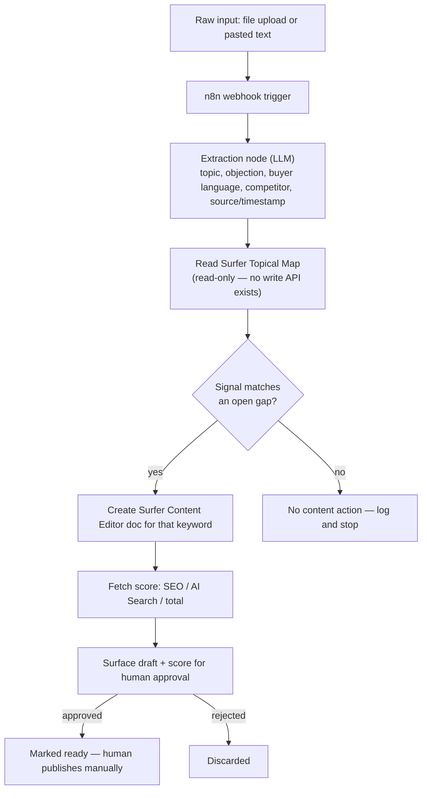

# Track 1 — Orchestration: Raw Data → Webhook → Surfer Content

**Self-contained implementation doc.** You shouldn't need to read the other files in this repo to start building, though DATAFLOW.md has the fuller architecture picture if you want context. This is one of three parallel tracks (Track 2 = Mirality app model-agnostic backend, Track 3 = Mirality's public site as the publish target) — you can build this one independently, nothing here blocks on the other two.

## TL;DR

Build a pipeline: someone drops in raw GTM signal (a sales call transcript, notes, anything text-based) → it gets turned into structured data (topic, objection, buyer's own language) → that gets checked against Surfer SEO's Topical Map for a content gap it matches → if it matches, create a Surfer Content Editor doc for that keyword and pull back its score → surface the result for a human to approve before anything gets published. Nothing auto-publishes, ever.

## Before you start — access checklist

- [ ] **Surfer workspace invite** — Oleg needs to add you as a team member on his Surfer workspace (`1385655-ohsuvorav`) before you can connect. Ping him tonight if you don't have this yet — you're fully blocked without it.
- [ ] **Surfer MCP connector** — once you have workspace access, connect it like any custom MCP connector (Claude Desktop/claude.ai: Settings → Connectors → Add custom connector). Docs: `https://docs.surferseo.com/en/articles/12944186-surfer-mcp`. Sign in once, session persists.
- [ ] **n8n account** — sign up free at n8n.cloud, or self-host if you'd rather. No strong opinion here; cloud is faster to get running for a hackathon.
- [ ] **GitHub repo access** — you should already have a collaborator invite on `ohsuvorav/gtm-hackathon`. Accept it, clone it.

## Why this exists (one paragraph, for context)

GTM content usually gets written from a blank page, disconnected from what buyers actually say in real conversations. Surfer's content scoring is legitimately useful (real SERP-based analysis, not an LLM guessing), but nothing today feeds it real conversational signal — it only ever gets keyword-research-driven input. This closes that gap: real signal in, Surfer-scored content out, human still decides what ships.

## Architecture

## What Surfer's MCP actually gives you (confirmed capabilities — exact tool names aren't published, only these)

- Create Content Editor docs for a target keyword
- Write articles via Surfer AI (requires an outline-approval step — not one-shot, budget for a round trip)
- Run Auto-Optimize on existing content
- Check SEO / AI Search / total content scores
- Read/adjust guidelines (terms, topics, structure, competitors)
- Get optimization + topic recommendations
- Fetch AI Visibility data (AI Tracker)
- **NOT available via MCP: Topical Map editing.** It's dashboard-only, confirmed via Surfer's own API docs ("Topical mapping and competitor pruning are currently dashboard-only and do not have API endpoints"). It auto-refreshes every 14 days on its own. You read it, you don't write to it.

First thing to do once connected: run a basic call like "list my workspaces" or "show my topical map" to confirm the connection works and see the map's actual shape — the exact matching logic in step 4 below depends on what that data looks like, which isn't fully known until you're actually connected.

## Build steps, with acceptance criteria

**1. Confirm Surfer MCP connection works**
Acceptance: a read-only call (list workspaces, or read the topical map) returns real data from the `1385655-ohsuvorav` workspace.

**2. Build the extraction node**
Input: raw text (a transcript or notes). Output: structured JSON — `{ topic, objection, buyer_language, competitor, source, timestamp }`. Test on 2-3 real or realistic sample transcripts before wiring anything downstream.
Acceptance: given a sample transcript with an obvious objection in it, the node correctly pulls it out into the `objection` field (not buried in a paragraph).

**3. Build the gap-matching step**
Read the Topical Map, compare the extracted topic/objection against open gaps. This is the one piece with no confirmed automated approach yet (see Risk below) — a first pass can be an LLM call that takes the map's gap list + the extracted signal and returns a match or no-match plus which keyword it matches.
Acceptance: given a signal that clearly matches a real gap in the map, the step returns that gap's keyword. Given one that doesn't match anything, it correctly returns no-match rather than forcing a false match.

**4. Wire the Surfer write call**
On a match, call Content Editor creation for that keyword, then fetch its score.
Acceptance: a real Content Editor doc appears in the Surfer workspace, with a real score returned to the pipeline.

**5. Add the human-approval surface**
Simplest option: post the draft + score into a Slack channel or send an email with an approve/reject action. Don't over-build this — a message with a link to the Surfer doc and a thumbs-up reaction is enough for a demo.
Acceptance: a human can see the draft and its score, and explicitly approve or reject it — nothing publishes without that step.

**6. Wire the webhook trigger**
n8n webhook that accepts a file upload or pasted text, kicks off steps 2-5.
Acceptance: dropping in a real transcript via the webhook runs the full pipeline end-to-end with no manual intervention until the approval step.

**7. End-to-end run + demo rehearsal**
Run it on a genuinely real (or very realistic) transcript, not a toy example — the demo's credibility depends on this feeling real, not staged.

## Scope — out (don't build these)

- Editing/generating the Topical Map itself — confirmed dashboard-only
- Auto-publishing content anywhere
- Any input source beyond file upload/pasted text for v1 (Slack/Teams/auto-push are later extensions, not required now)
- A polished UI — a Slack message or plain webhook response is fine

## Constraints

- Agent-first, but the agent never publishes — every write ends at "ready for human approval," full stop
- Build on Surfer's existing MCP — don't build custom content-scoring logic, that's the whole point of using Surfer instead of just prompting an LLM
- Keep the extraction node's output schema stable — Track 2 (Mirality) may end up reusing the same extraction step, so don't design it as a one-off

## Known risk

Step 3 (gap-matching) is the one part of this pipeline with no proven approach yet. If an LLM-based match against the raw map data turns out unreliable, a fallback is to skip automated matching entirely for the demo — just always create a Content Editor doc for whatever topic the extraction step found, and let the human judge relevance instead of the pipeline. Simpler, less impressive, but still real and functional if time runs short.

## Demo script (~90 seconds)

1. Drop a real transcript into the n8n webhook
2. Show the extracted signal (objection, buyer language) appearing
3. Show the match against the Topical Map (or the fallback: show the Content Editor doc getting created)
4. Show the real Surfer score coming back
5. Show the approval message landing in Slack
6. Line: "This used to be two disconnected jobs — someone reads the call, someone else guesses what to write. Now it's one pipeline, and the content is scored by Surfer's real engine, not a guess."
